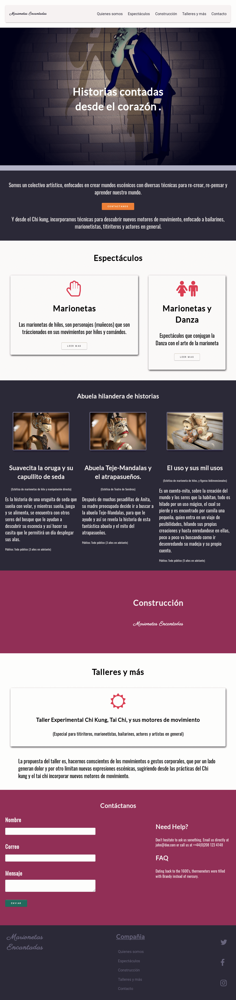

# Marionetas Encantadas

This is another project which I am doing for a friend which has been proving to be somewhat of a challange. 

The owner of the Puppet company lives outside a small town, which is quite far from one of the minor cities. All she has is an old mobile phone with, what is my best guess, a screen size somewhere around three inches.

As of November 16, 2017, the project is still under construction and will go under several changes.

The CSS and Javascript code are written from scratch. There are several animations and transitions on the website. There are few other minor touches, but the content and design feel that they need to be re-worked.

